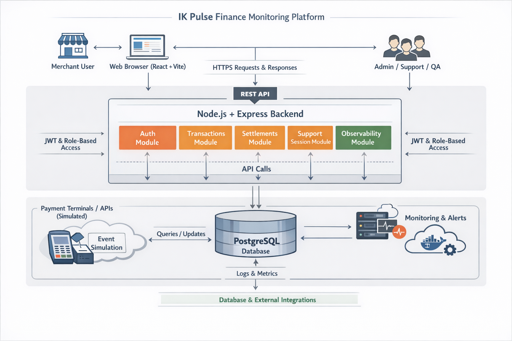

# IK Pulse

> A fintech-inspired merchant operations platform designed to model how transactional data flows through a system.



IK Pulse is a fintech-inspired merchant operations platform built to explore how transactional data can be surfaced in a clear, operationally useful way for both merchants and internal support users.`

The application models a number of concepts that are especially relevant in payment systems and business tooling, including:

- authentication and role-based authorization
- transaction monitoring and retry flows
- settlement visibility
- internal support session workflows
- observability and operational reporting
- backend simulation of transaction activity
- CI/CD and cloud deployment

This project was designed as a structured full-stack system rather than just a UI exercise. The main goal was to model how transactional information moves through a product in a way that is understandable, maintainable, and realistic enough to discuss architecture and engineering trade-offs seriously.

## Tech Stack

### Frontend
- React
- TypeScript
- Vite
- Zustand
- Recharts
- Tailwind CSS
- Lucide React

### Backend
- Node.js
- Express
- TypeScript
- PostgreSQL
- JWT authentication

### Deployment
- Vercel for frontend hosting
- Render for backend hosting
- PostgreSQL as the system of record

## Core Features

- Merchant login and role-based access
- Dashboard with transaction summaries
- Transactions page with filtering, pagination, and retry handling
- Settlements page for payout-style visibility
- Support session workflow for controlled internal troubleshooting
- Observability page for operational insights
- Backend transaction simulator
- Login alert email notifications

## Project Philosophy

IK Pulse was intentionally built as a **modular monolith** on the backend. This keeps the system easier to understand and evolve while still maintaining strong separation of responsibilities between domains such as auth, transactions, settlements, support sessions, and observability.

The frontend follows a component-driven structure, where pages orchestrate the experience and reusable components handle focused presentation responsibilities.

## Documentation

Additional documentation is available in the `docs/` folder:

- [Architecture](./docs/ARCHITECTURE.md)
- [API Overview](./docs/API_OVERVIEW.md)
- [Authentication and Support Sessions](./docs/AUTH_AND_SUPPORT.md)
- [Data Model](./docs/DATA_MODEL.md)
- [Deployment](./docs/DEPLOYMENT.md)
- [Future Improvements](./docs/FUTURE_IMPROVEMENTS.md)
- [Project Walkthrough](./docs/PROJECT_WALKTHROUGH.md)

## Running the Project

### Frontend
```bash
cd client
npm install
npm run dev